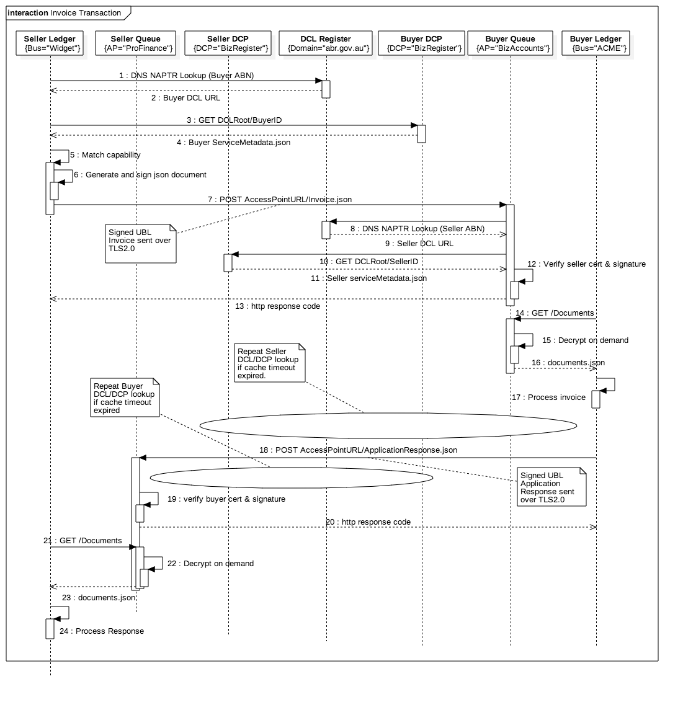

# The e-Invoice Transaction

This section continues the use case story from the [metadata publishing and lookup](publishing.md) page.  Please read that page first.

The recipient of an e-invoice musy have confidence that it was issued by the sender ABN and not some third party masquerading as that ABN.  Also, both parties should have confidence that the potentially sensitve commercial information cannot be seen by malicious third parties.

Unlike updating the metadata registry entry, which is an occasional process, sending and receiving invoices is a much higher volume activity and so it would be impractical to expect users to (for example) authenticate to VANguard for every invoice.  Therefore a different approach is used to ensure trust of identity and message integrity.  The framework uses PKI and the digital certificates published as part of the registry update process.

We will introduce two new parties.
* Widget Pty Ltd is a seller organisation that wants to send an e-invoice to ACME Pty Ltd.
* ProFinancials is the e-invoicing solution and access point provider for Widget Pty Ltd.



The use case for the secure exchange of the e-invoice and the business response documents is:
* user: Widget Pty Ltd accounts receivable staff create an invoice to ACME Pty Ltd in the normal way using their ProFinancials system.
* system: ProFinancials looks up the service metadata for ACME pty ltd via the DCL and DCP and confirms that there is a capability match (document standard and message transport).
* system: Profinancials signs the invoice using their private key (the corresponding public key is published with the certifiate in Widget Pty Ltd service metadata) and performs an SSL REST POST to the end point specified in the ACME service metadata with the signed invoice.json as the body.
* system: BizAccounts receives the invoice, retreives the seller party ABN (Widget's ABN) from the invoice document, does a DCL/DCP lookup using that ABN to get Widget's service metadata, and verifies the signature using the public key from Widget's service metadata.  This critical step verifies the chain of trust - that the sender of the invoice is the same party that (with VANguard authentication) created the registry entry.
* system: BizAccounts posts the invoice into ACME Pty Ltd Ledger in accordance with ACME standard invoice processing rules.  Typically, if the invoice is a demand for future payment then it will be matched against an order or contract.  If the invoice is a tax invoice (ie already paid with zero balance) then the invoice will be auto-reconciled against bank statement.
* user: If a demand for future payment, then ACME Pty Ltd accounts payable staff review / reconcile the invoice and follow their usual internal approval processes.
* system: Once processed, BizAccounts creates an response document that is returned to the seller party via the same process in reverse (ie BizAccounts will lookup, sign & send - then ProFinancials will verify signature and reconcile against the invoice).

## A Note About Routing

The RESTful implementation makes a key assumption that the access point URL path for POSTing a document contains whatever information the access point needs to deal with the document.  Typcially that means the URL should include information identifying the document type, business process, and the recipient business.  For example, in the URL below, document type is "invoice-1", process is "purchase", and recipient business identifier is 23601120601.

```
"EndpointURI": "https://api.accounts.com/au/essentials/businesses/23601120601/purchase/invoice-1"
```

Note that the sender party (ie who the document is from) is not in the end-point URL path (it would make no sense to do so).  Instead that information is in the body of the invoice document.  The ultimate receiver system will process the document and, where appropriate use the same registry lookup and RESTful transport to send response documents to the sender party.

