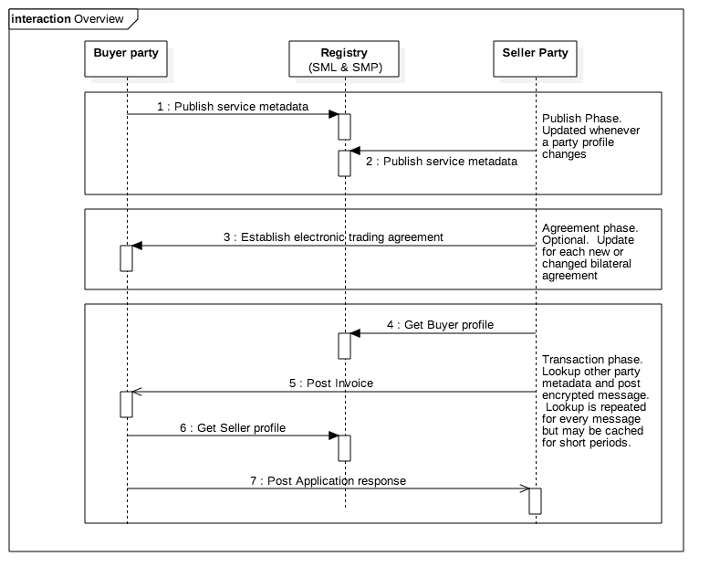

# eInvoice REST API Framework Documentation
This repo documents the development of an Australian National e-Invoicing standard, which will utilise simple RESTful APIs where appropriate.  This work is governed by the [Australian Digital Business Council](http://digitalbusinesscouncil.com.au/).

Development of an industry-led standard will enable accounting software product vendors to offer new services that: 
* allow any business to send an e-invoice to any other business if they know the other business' unique identifier (usually an ABN)
* (optionally) allow businesses to publicly indicate that a pre-existing trading agreement must exist between themselves and another party, before they will exchange electronic documents and invoices with said party.  

## How it works
It works like a city phone book.  If party A wants to send an invoice to party B, party A looks up the invoice service information of party B in a registry and sends the invoice to the location, and using the technical standards, specified in the registry.  
* Each party publishes information about their invoicing capabilities (supported documents & transports, certificates, URL end points) to a registry.  In most cases, we envisage that software packages will manage this process on behalf of their customers.  
* A registry entry can be updated by the business itself, or third-parties granted authorisation by the business. Updates will generally occur when there is a change to a party's technical profile.
* Optionally, a party may specify (via their service information registry entry) that a trading agreement is required before they will accept electronic documents.  In such cases, either party can initiate the trading request and, if agreed by the other party, the whitelist is updated with the relevant identifiers and the parties can exchange documents.
* Bidirectional document excahnge entails looking up the other party's service data and public key/certificate, encrypting the invoice data and sending it to the other party.
* Publishing public keys/certificates on a central registry will allow transacting parties to authenticate one another and verify the authenticity of electronic documents received (e.g. via digital signing).
* All interfaces will be implemented as simple REST APIs that conform to the [Australian Government API design guide](https://www.dto.gov.au/standard/design-guides/api/).

## The API specifications

Are published to [swaggerhub](https://swaggerhub.com/api/ausdigital/invoice/0.1).

Sequence diagrams and a little more details "how it works" information is provided for each of the three phases in the overview:
* [Publishing to the registry](publishing.md)
* [Trading agreements](agreements.md)
* [e-invoice transaction](transactions.md)

## The Reference Implementations

Are maintained in associated github repos
* [The SMP register](https://github.com/ausdigital/einvoice-ref-smp)
* [The e-invoice end point](https://github.com/ausdigital/einvoice-ref-api)

## Our Timeline

This project is run in accordance with the Australian government digital transformation office [service design and delivery methodology](https://www.dto.gov.au/standard/service-design-and-delivery-process/).  We kicked off early May 2016 with the "discovery" phase and we aim to deliver the following milestones:
- "alpha" REST API specification for all services by June 30 2016 (registry publishing, trading agreements, end-point lookup, and e-invoice transaction)
- "alpha" implementation prototypes of the SMP register and e-invoice service end points by July 31 2016.
- "beta" REST API specification (updated with lessons learned from the alpha implementation) by 15 August 2016
- "beta" open source toolkits for SMP registers and e-invoice end points by 30  Sept 2016

## Our Team

Are you a software developer that has a product that provides any part of the procure to pay process? If so then your users would benefit from end-to-end automation with their trading partners.  No more scanning of paper invoices or re-keying and uploading PDF attachments.  We welcome your participation in this project.  All standard specifications are licensed under Creative Commons and all code will be redistributable open source under Apache 2 license.  

The team so far
* SAP Australia, representing a large proportion of the largest organizations in Australia.  SAP runs the Ariba B2B ecommerce network with over 2million global organizations on the network.  The alpha prototype will include connecting up the Ariba network
* MYOB, representing over half a million small businesses in Australia that send or receive invoices and would benefit from deeper integration
* Westpac, one of Australia's largest financial institutions.  Bringing their experience as the operation of the largest superannuation B2B gateway and as a founder member of the NPP (new payments platform) which will revolutionize payments in Australia
* the department of industry innovation and science. As the chair of the e-invoicing governance group, the department will ensure open governance for the project. The department also provides the VanGuard service which can validate ABN ownership and so inject trust into the network.

This working group is led by Steve Capell.  Please contact me via [linkedIn](https://au.linkedin.com/in/stevecapell) if you'd like to contribute to this effort.

