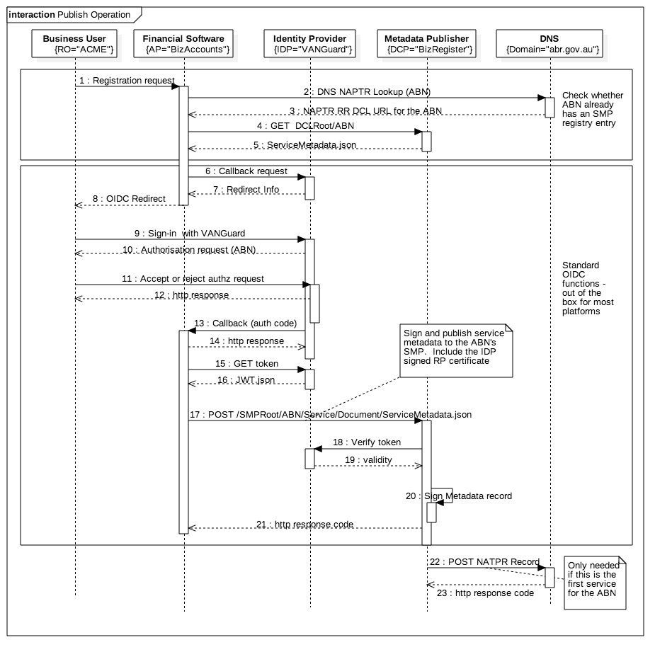

## Publishing Registry Entries

To publish a registry entry for a specific business;
* Business user chooses (via their financial software system) to participate in e-invoicing.
* The financial software system checks with the business already has an entry in the register. If so then the software must update the existing entry rather then create a new one.
* The financial software system redirects the user to an approved OIDC identity provider (we show the Australian government VANGuard IDP in this case) where the the business user will verify their identity and authorise the registry entry publishing action.
* The financial software creates a keypair and signing certificate for the business and get the certificate signed by the IDP as root CA.
* Using the JWT token from the OIDC provider, the financial software creates / updates the business registry.  



## The RESTful Specification

Based on the following reference standards:
* [OASIS SMP Specification v1.0](https://docs.oasis-open.org/bdxr/bdx-smp/v1.0/csprd01/bdx-smp-v1.0-csprd01.html)
* Australian Digital Business Council (ADBC) DCP Implementation Guide

But with a simpler RESTful interface.  Please refer to the technical specifications from the ADBC technical Working Group REST SubGroup
* [Publishing metadata](https://github.com/ausdigital/framework-docs/blob/master/publishing.md)
* [SwaggerHub SMP Specification](https://swaggerhub.com/api/ausdigital/smp/0.1)

## Digital Capability Lookup (DCL)

We propose that there should be one DCL per ID scheme - so, as a registrar, if you want to play in this game, you also have to host a DCL. That way there is a simple key into the register because the entity ID can be guaranted unique within the scheme.  The current spec assumes one DCL that is independent of the registrar and so must accomodate queries for multiple schemes (eg ABN and DUNS) so the query needs to be qualified by the scheme.  Anyhow, it's easy to do both.  In principle you can lookup if lots of places with different keys - provided you get the same answer.

### Standard based Lookup 

Given ABN 23601120601, follow the standard (scheme qualified) means to lookup the DCP.  This model takes a scheme urn qualified business identifier and generates a hash, then does a NAPTR lookup:
* Pre-hashed participant ID is urn:oasis:names:tc:ebcore:partyid-type:iso6523:0151::23601120601   (the long urn means "abn")
* Post-hash participantDI is CBE872FF8B11A14A0B746E0D212A5400
* DNS NAPTR query URL is B-CBE872FF8B11A14A0B746E0D212A5400.digitalbusinesscouncil.com.au
* DNS response would be http://companybook.net
* Query into DCP is then the URL encoded scheme-qualified participantID http://smp.com/urn%3Aoasis%3Anames%3Atc%3Aebcore%3Apartyid-type%3Aiso6523%3A0151%3A%3A23601120601
* Response from DCL is a list of <ServiceMetadataReference> of the form <DCP_Root>/ParticipantID/services/DocumentID where both participantID and DocumentID are namespace qualified and URL envcoded.  For example:
* http://smp.com/urn%3Aoasis%3Anames%3Atc%3Aebcore%3Apartyid-type%3Aiso6523%3A0151%3A%3A23601120601/services/urn:www.digitalbusinesscouncil.com.au:dbc:einvoicing:doctype:core-invoice:xsd::core-invoice-1##urn:www.digitalbusinesscouncil.com.au:dbc:einvoicing:process:einvoicing01:ver1.0"
* Finally GET the relevant service metadata

### Simplified Lookup

The simplified lookup assumes that each registrar will also host a DCL and that the result is a direct link to the perticipant's service metadata collection.
* NAPTR record lookup on 3601120601.abr.gov.au returns http://smp.com/AD225E23965985E1720B397EF17B4117
* Do a GET on that URL and get back service metadata collection for ABN 3601120601

Note that the key for the entry into the DCP is a GUID generated by the DCP. there is no need for a convention because the lookup to DCL already specifies the participant ID - so the URL from DNS should just point directly to the business entry in the SMP. It is worth noting that a NAPTR lookup via DUNS DCL (eg 752219050.dnb.com would return exactly the same DCP entry point.

## Digital Capability Publisher (DCP) 

The Service metadata profile below shows an example of a business that
* is identified with both an ABN and a DUNS
* can receive normal invoices via REST or (via a gateway provider) ebMS3/as4
* can receive an RCTI via REST
* Supports end-to-end signatures over REST but not as4

### Standard based Service Group Lookup

In the normatiuve standard model, each DCP must host a service group for each participant that returns a list of actual service metadata end points for that participant.  The service group end point must be of the form <DCP_doamin>/<URL Encoded ParticpantID>

GET http://smp.com/urn%3Aoasis%3Anames%3Atc%3Aebcore%3Apartyid-type%3Aiso6523%3A0151%3A%3A23601120601

The Response is a list of service metadata locations of the form <DCP_doamin>/<URL Encoded ParticpantID>/services/<URL encoded documentID##processID>

```
   {"ServiceGroup": {
      "ParticipantIdentifier": {"scheme": "abn", "value": "23601120601"},
      "ServiceMetadataReferenceCollection":[{
         "ServiceMetadataReference" : ”http://smp.com/urn%3Aoasis%3Anames%3Atc%3Aebcore%3Apartyid-type%3Aiso6523%3A0151%3A%3A23601120601/services/urn:www.digitalbusinesscouncil.com.au:dbc:einvoicing:doctype:core-invoice:xsd::core-invoice-1##urn:www.digitalbusinesscouncil.com.au:dbc:einvoicing:process:einvoicing01:ver1.0",
         "ServiceMetadataReference" : ”http://smp.comurn%3Aoasis%3Anames%3Atc%3Aebcore%3Apartyid-type%3Aiso6523%3A0151%3A%3A23601120601/services/urn:www.digitalbusinesscouncil.com.au:dbc:eprocurement:doctype:core-order:xsd::core-order-1##urn:www.digitalbusinesscouncil.com.au:dbc:eprocurement:process:eordering01:ver1.0"}]
       }
    }
```

### Simplified Service metadata lookup 

In the simplified model, the DCP entryproint from the DCL directly returns a collection of zero or more <ServiceMetaData> entries.  There is no need for any intermediate service group lookup.

So GET http://smp.com/AD225E23965985E1720B397EF17B4117 will just directly return the structure shown below.  
So will GET http://smp.com?abn=23601120601

### Service Metadata Request

The detailed service metadata request API is entered with either the standard or simplified URLs:
* standard : http://smp.com/urn%3Aoasis%3Anames%3Atc%3Aebcore%3Apartyid-type%3Aiso6523%3A0151%3A%3A23601120601/services/urn:www.digitalbusinesscouncil.com.au:dbc:einvoicing:doctype:core-invoice:xsd::core-invoice-1##urn:www.digitalbusinesscouncil.com.au:dbc:einvoicing:process:einvoicing01:ver1.0"
* simplified : GET http://smp.com/AD225E23965985E1720B397EF17B4117  (or whatever is returned by the DCL DNS lookup).

### Service Metadata Response

    {"ServiceMetadata":[{
      "ParticipantIdentifier": {"scheme": "abn", "value": "23601120601"},
      "ParticipantIdentifier": {"scheme": "duns", "value": "752219050"},
      "DocumentIdentifier": {"scheme": "dbc-docid", "value": "invoice-1"},
      "ProcessList": [{
        "ProcessIdentifier": {"scheme": "dbc-procid","value": "invoice-1"},
        "ServiceEndpointList": [
          {
          "transportProfile": "REST-POST",
          "EndpointURI": "https://api.myob.com/au/essentials/businesses/23601120601/purchase/invoices",
          "RequireBusinessLevelSignature": "true",
          "MinimumAuthenticationLevel": "2",
          "ServiceActivationDate": "2015-05-01",
          "ServiceExpirationDate": "2018-05-01",
          "Certificate": "TlRMTVNTUAABAAAAt7IY4gk....",
          "ServiceDescription": "invoice service",
          "TechnicalInformationUrl": "http://developer.myob.com/api/essentials-accounting/endpoints/"},
          {
          "transportProfile": "dbc-as4",
          "EndpointURI": "https://accesspoint.com/as4service/",
          "RequireBusinessLevelSignature": "false",
          "MinimumAuthenticationLevel": "2",
          "ServiceDescription": "as4 message service",
          "TechnicalInformationUrl": "http://www.acesspoint.com/as4info"}]
        },{
        "ProcessIdentifier": {"scheme": "dbc-procid","value": "rcti-1"},
        "ServiceEndpointList": [
          {
          "transportProfile": "REST-POST",
          "EndpointURI": "https://api.myob.com/au/essentials/businesses/23601120601/sales/invoices",
          "RequireBusinessLevelSignature": "true",
          "MinimumAuthenticationLevel": "2",
          "ServiceActivationDate": "2015-05-01",
          "ServiceExpirationDate": "2018-05-01",
          "Certificate": "TlRMTVNTUAABAAAAt7IY4gk....",
          "ServiceDescription": "invoice service",
          "TechnicalInformationUrl": "http://developer.myob.com/api/essentials-accounting/endpoints/"}]
        }]
      },
    "Signature": "AD56YGNN8876TTFJ123…"
    },
    {... another signed service metadata structure ...
    }]
    
```

