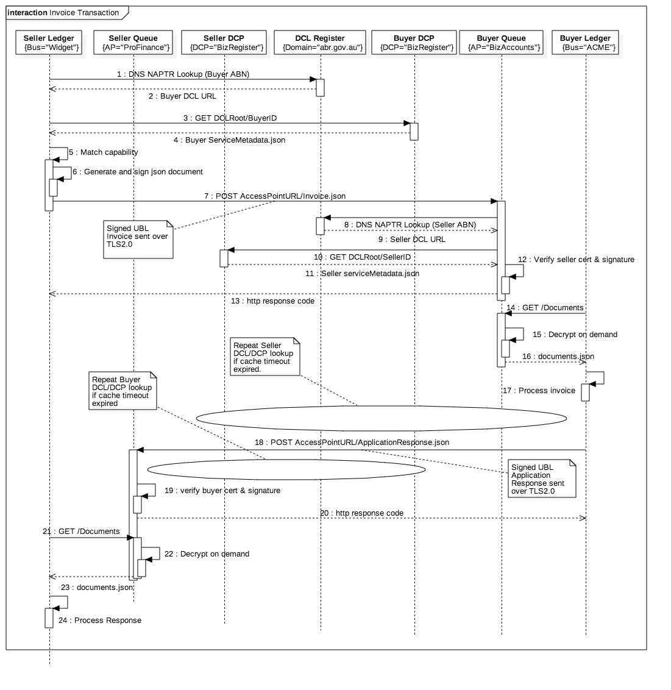

The e-Invoice Transaction

Although it looks a bit complex, it's pretty simple really.  The key thing is that, unlike most REST services that have a single provider, this is a many-many data exchange so there are many providers of the same e-invoice service (basically every ABN in australai eventually).  That means that a key part of the transaciotn is an ens-point lookup.  Just like DNS (actually part of it IS DNS), you provide an ABN and the lookup says where to POST the invoice.

